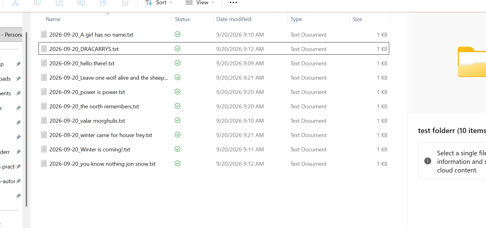
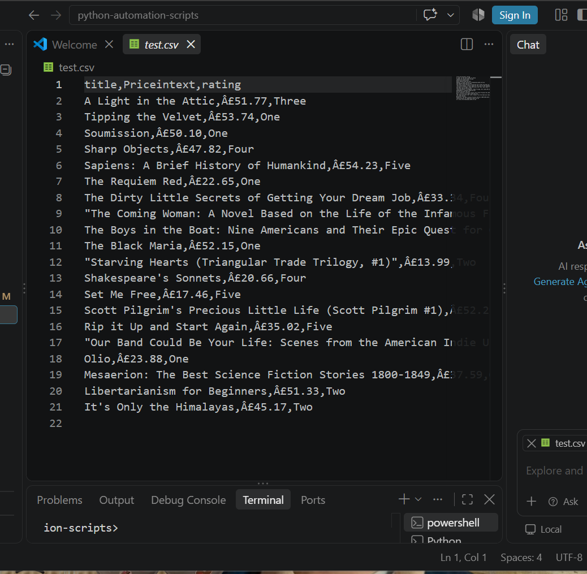
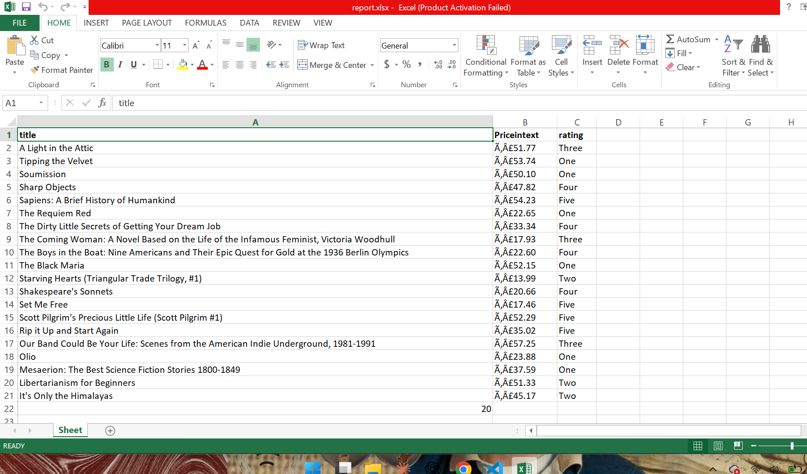
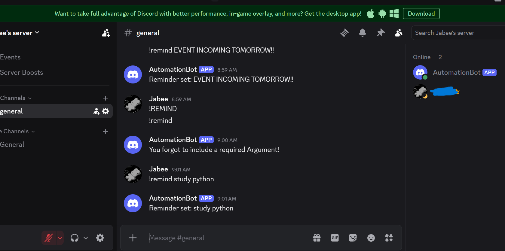
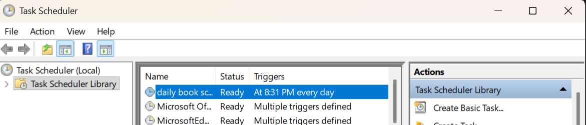

# Python Automation Scripts

A collection of small automation tools built to solve real repetitive tasks — 
scraping data, generating reports, renaming files in bulk, and a Discord bot 
for quick reminders.

ee [JOURNEY.md](./JOURNEY.md) for the day-by-day build log.

## Scripts

### rename_files.py
Saves you from manually renaming dozens of files one by one — automatically 
adds today's date to the front of every file in a folder.
```bash
python rename_files.py
```


### scraper.py
Pulls data (titles, prices, ratings) straight from a website into a clean 
spreadsheet — no manual copy-pasting. Works with any URL and output filename 
you give it.
```bash
python scraper.py --url <target_url> --output <filename.csv>
```
**Note:** currently configured to scrape books.toscrape.com's page structure. 
Can be adapted to other sites by updating the HTML selectors.


### report_generator.py
Turns a messy spreadsheet into a clean, presentation-ready Excel report — 
bold headers, properly sized columns, totals calculated automatically. 
The kind of formatting task that normally eats up 20+ minutes by hand.
```bash
python report_generator.py
```


### discord-bot/bot.py
A Discord bot that sets reminders on command and replies with helpful 
messages instead of crashing if used incorrectly.
```bash
python bot.py
```
Requires a `.env` file with `DISCORD_BOT_TOKEN=your_token_here`.


## Scheduling
scraper.py can run automatically on a set schedule (daily, weekly, etc.) 
via cron or Task Scheduler — no need to run it manually.
Example: `0 9 * * * python3 scraper.py --url ... --output ...`


## Tech used
Python, requests, BeautifulSoup, openpyxl, discord.py, argparse